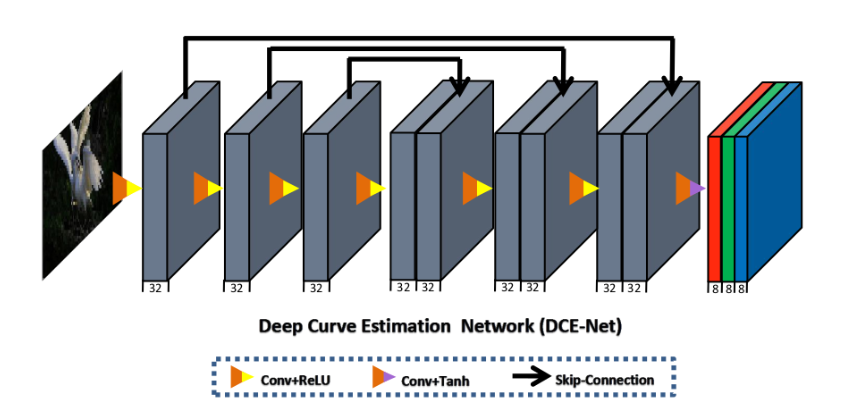

# Low Light Enhancement Using Zero-Reference Deep Curve Estimation
## Introduction
Most photos, especially with the growth of mobile cameras, captured suffer compromised aesthetic
quality because of incorrect or not optimal lighting conditions. These sub-optimal conditions
are mostly because of the lack of awareness about lighting strategy, which is the case with nonprofessional
or laymen photographer. To overcome this, we can process these low light images with
low light enhancing techniques that will improve the quality of the original picture. Here,
I explored one such technique from [[1]](https://openaccess.thecvf.com/content_CVPR_2020/papers/Guo_Zero-Reference_Deep_Curve_Estimation_for_Low-Light_Image_Enhancement_CVPR_2020_paper.pdf). The method explored here, formulates light enhancement
as a task of image specific curve estimations using a light weight deep neural network.

## Methodology
**Light Enhancement Curves:** Light enhancement curves are
inspired from curves that are frequently used in photo editing to adjust the pictures, by operating
at pixel level. They try to map low light image to its enhanced image automatically. The neural
model, we will discuss, essentially tries to model these light enhancement curves, given the input
image. How are these curves used to enhance the image though? \
Below equation mathematically
answers this question\
$$LE_n(x) = LE_{n−1}(x) + A_n(x)LE_{n−1}(x)(1 − LE_{n−1}(x))$$\
Where $A_n$ is curve map that does pixel wise curving.
It is very apparent that this equation is recursive. Meaning to obtain nth level enhanced image it
needs ${n − 1}^{th}$ enhanced image and nth pixel level curve map. Now the goal in this work was to estimate the $A$′s,
for which a deep learning architecture, called zero-reference DCE (DCE-Net), is used.\
\
**DCE-Net:** The models learns to map the input, typically a low light image, to its best
fitting curve parameter map. The architecture is a plain CNN assemble of seven convolution layers
with symmetrical concatenation. Each layer consists of 32 convolutional kernels of size 3 × 3 and
stride 1 followed by ReLU activation. No down sampling or batch normalization is done since they
break the relation among the neighbouring pixels. Below is the visual representation of the model
architecture.\
\
\
The model outputs 24 curve maps with which we treat the input through 8 iterations, higher order
enhancement, to obtain the final version of the enhanced image. The advantage with this architecture
is that it is very light weight with only 79, 416 trainable parameters and while training, we
can resize the input to 256 x 256 or much lower if needed. And the resultant model can be used to
enhance image of any size and not just 256 x 256.\
\
**Non-Reference Loss:** Training here is not supervised but rather un-supervised utilizing non-
reference losses. There 4 such losses, which are combined during the back-propagation, that are used
here. They are Spatial Consistency loss, Exposure Control Loss, Color Consistency Loss and Illumination
Smootheness Loss. More information on them can be found in [[1]](https://openaccess.thecvf.com/content_CVPR_2020/papers/Guo_Zero-Reference_Deep_Curve_Estimation_for_Low-Light_Image_Enhancement_CVPR_2020_paper.pdf)\

## Training and Results
The dataset used for training the model is part1 of SICE dataset[2], which have 360 degree multi
exposure sequence of images. There are 3022 in total. To impart the model with a wide range of
dynamic range capability, this dataset is choosen, because it have both low-light and over-exposed
images. The dataset is randomly divided into 2422 and 600 images for training and testing respectively\
Below are some results from the trained model:\

1) Training: Look for the training script train_model.py
2) Inference: Look for the inferency script inference.py
3) Most of these scripts can be run in other environments with few tweaks
4) For the dataset refer to here https://drive.google.com/file/d/1HiLtYiyT9R7dR9DRTLRlUUrAicC4zzWN/view
5) Find the stable model under models

References\
[1] [Guo, Chunle, et al. "Zero-reference deep curve estimation for low-light image enhancement." Proceedings of the IEEE/CVF conference on computer vision and pattern recognition. 2020.](https://openaccess.thecvf.com/content_CVPR_2020/papers/Guo_Zero-Reference_Deep_Curve_Estimation_for_Low-Light_Image_Enhancement_CVPR_2020_paper.pdf)\
[2] Jianrui Cai, Shuhang Gu, and Lei Zhang. Learning a deep single image contrast enhancer
from multi-exposure image. IEEE Transactions on Image Processing, 27(4):2049–2026, 2018.\
[3] [https://keras.io/examples/vision/zero_dce/](https://keras.io/examples/vision/zero\_dce/)

